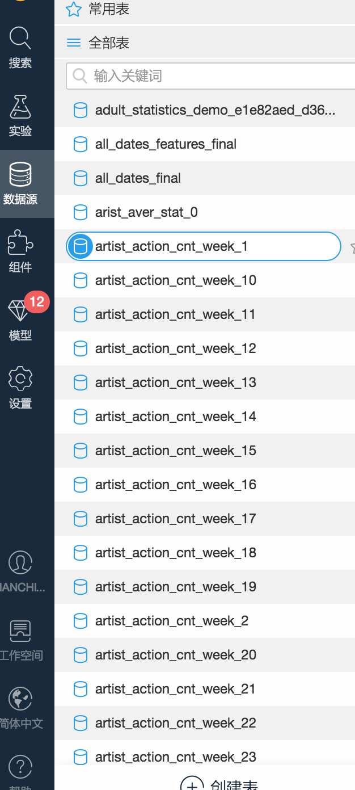

## This is a document with tianchi and shujia faq

### Q1:怎么生成测试数据时间序列?

代码如下:

    -- 拿到原始数据中后两个月的ds
    drop table if exists test_dates_0;
    create table test_dates_0 as select distinct(ds) from odps_tc_257100_f673506e024.mars_tianchi_user_actions where ds >20150701 and ds <=20150831;
    select * from test_dates_0 limit 20;
    
    -- 从bigint转为datetime
    drop table if exists test_dates_1;
    create table test_dates_1 as select to_date(ds,"yyyymmdd") as ds  from test_dates_0;
    
    select * from test_dates_1 limit 20;
    
    -- 增加60天
    drop table if exists test_dates_2;
    create table test_dates_2 as select dateadd(ds,61,"dd")  as ds from test_dates_1;
    
    select min(ds), max(ds) from test_dates_2;
    
    -- ds 转成字符串
    create table test_dates_3 as select cast(ds as string) as ds from test_dates_2;
    select * from test_dates_3 limit 20;
    
    
    -- 删除time部分
    drop table if exists test_dates_4;
    create table test_dates_4 as select concat(substr(substr(ds,1,10 ),1,4),substr(substr(ds,1,10 ),6,2),substr(substr(ds,1,10 ),9,2))as ds from test_dates_3;
    select * from test_dates_4 limit 20;
    
    create table test_dates_final as select ds, 'a' as join_flag from test_dates_4;
    select * from test_dates_final limit 20;
    
    -- train data ds
    create table train_dates_final as select distinct(ds), 'a' as join_flag from odps_tc_257100_f673506e024.mars_tianchi_user_actions;
    select count(*) from train_dates_final limit 20;
    
    create table all_dates_final as select * from
    (
    select * from train_dates_final
    union all
    select * from test_dates_final
    ) tmp;
    select count(*) from all_dates_final limit 20;
    
    --添加日期信息
    create table all_dates_features_final as select 
    ds, 
    weekday(to_date(ds,"yyyymmdd")) as day_of_week, 
    weekofyear(to_date(ds,"yyyymmdd")) as week_of_year,
    substr(ds,5,2)  as month,
    substr(ds,7,2)  as day,
    join_flag
    from all_dates_final;

### Q2:规则是什么？
规则是用简单的、不精确、自己总结出来的的方法做预测。比如音乐流行趋势预测中，把七、八月的播放量作为九、十月播放量的预测，又或者是把七八月的均值，作为九、十月的预测。

### Q3:wm_concat的使用

    a   b   1
    a   b   2
    a   b   3
    c   d   4
    c   d   5
    c   d   6
    
    变为
    a   b   1   2   3
    c   d   4   5   6
    
    groupby + wm_concat 然后拆分字段(注意长度是否一致)
    
    
### Q4:随机森林报错too many class
分析,可能把播放次数当做类别,random forest 应该无法支持那么多class数,另外天池音乐推荐应该是回归问题,不是分类问题.

### Q5:数加怎么做pivot?原生Hive里面能够直接引用udf

### Q6:最终播放次数有.0如何解决?
ceil 或者 cast(fieldname as int )

### Q7:回归函数评估函数貌似不可用?
是的, 如果只是简单的RMSE or RMAE 自己写个sql就好了,下面是我写的部分,之后看看那个比赛的评估指标是否能用sql完成:

    drop table if exists eval;
    create table eval as select abs(plays_cnt - prediction_score) as x1, pow(plays_cnt - prediction_score, 2) as x2 from result_lr_2;
    select sum(x1)/6000 as RAME, sum(x2)/600 as RSME from eval;
    
### Q8:Xgboost很奇怪,无法调节num_rounds,且最后预测结果每个artist_id每天的播放次数都一样?
xgboost 回归模块貌似无法更改num_rounds,且播放次数都一样,我这里没有找到为啥,可能是数据的问题?在LR当中最终的预测比较正确.

### 个人生产的表为啥不见了

这里应该是每天更新,但是数据还是在你的项目空间里,如果想看的话 可以到算法平台部分可以看到你生产的数据,如下图:

##fork this project and commit a pr, I'll merge it as soon as possible.

##Resources

**天池大数据比赛交流群: 155167917**

[ODPS-tutorial-v1.pdf](./resources/ODPS-tutorial-v1.pdf)

[数加平台OPEN_MR的使用参考.pdf](./resources/数加平台OPEN_MR的使用参考.pdf)

[ODPS最新SQL参考手册.pdf](./resources/ODPS最新SQL参考手册.pdf)

[数加-pom.xml](./resources/pom.xml)
